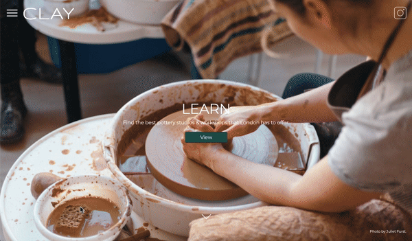

# CLAY - Final Project

CLAY is a responsive multipage website which would allow users to find pottery studios and art galleries across London. This project also features a two content driven pages and a joining form.

To accomplish this, I was tasked at using the technologies and methods that I had learned during the 10 week part-time course at General Assembly.

## Timeframe

1 week 

## Users should be able to:
1. Experience full page scrolling in Homepage

1. Show and hide navigation items when clicking on the ☰ or ✖️ icons

1. Hovering over 'View on map' in LEARN and COLLECT pages would trigger a underlining animation 

1. Pages LEARN and COLLECT show a Google Map with one Marker per listed item in the page

1. Clicking 'View on map' will trigger a bounce animation on the linked marker and stop after some time

1. Subscribe to newsletters

## Technologies
* HTML
* CSS
* Java Script
* API's
* Plug-ins

## Approach 

I approached this project with the idea of having a simple site that would allow users to view, discover and locate pottery studios and art galleries across London. I planned to do this before starting on tasks such as signing up form, animation for 'View on Map' and responsive desing, as it would allow me a solid base to build on and hit the majority of points for MVP.

The major blocker in this project was the use of APIs, as I had only been working with it for a week so I spend a lot of time researching the technology and finding solutions such as `onclick="showme(1)"` property incorporated on HTML elements.

## To do

* Add an Instagram Feed Carousel in About page.
* Built a back-end for website.

## Resources
* Images
	* Unsplash
* Fonts
	* Google Fonts
* Plug-ins
	* fullPages
* API's
	* Google Maps 
